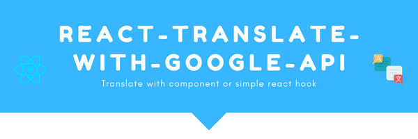

<p align="center">
  <a href="#" rel="noopener">
 </a>
</p>

<h2 align="center">React Translate with Google API</h2>

<div align="center">

[](#)
[](https://github.com/girishsawant999/react-translate-with-google-api/issues)
[](https://github.com/girishsawant999/react-translate-with-google-api/pulls)

[](https://github.com/girishsawant999/react-translate-with-google-api/actions)
[](/LICENSE)

</div>

---

<p align="center"> A react package created to translate the text using Google Translate API.
    <br> 
</p>

## 📝 Table of Contents

- [About](#about)
- [Installation](#installation)
- [Usage](#usage)
- [Built Using](#built_using)
- [Contributing](./.github/CONTRIBUTING.md)
- [Authors](#authors)

## 🧐 About <a name = "about"></a>

Pass your string as a children to component and provide language to the component it will translate the string to the language you provided.

## Installation <a name = "installation"></a>

Let's start with the following steps.

- Now run the following code in project directory to install dependency.

  ```bash
    npm i @girishsawant999/react-translate-with-google-api
  ```

- Thats all you are ready to use translate component.

## Usage <a name = "usage"></a>

Add following code in **index.js** file.

```jsx
import { setupConfig } from '@girishsawant999/react-translate-with-google-api';

setupConfig({
  clientEmail: process.env.REACT_APP_GCP_CLIENT_EMAIL,
  privateKey: process.env.REACT_APP_GCP_PRIVATE_KEY,
  projectId: process.env.REACT_APP_GCP_PROJECT_ID
});
```

Now use Translate component

```jsx
import Translate from '@girishsawant999/react-translate-with-google-api';

<Translate language="fr-FR">Hello World</Translate>;
```

You will see output as "Bonjour le monde".

## ⛏️ Built Using <a name = "built_using"></a>

- [React](https://reactjs.org)
- [Parcel](https://parceljs.org)
- [Typescript](https://www.typescriptlang.org)
- [Javascript](https://developer.mozilla.org/en-US/)
- [Jest](https://jestjs.io)

## ✍️ Authors <a name = "authors"></a>

- [@girishsawant999](https://girishsawant999.github.io) - Idea & Initial work

See also the list of [contributors](https://github.com/girishsawant999/react-translate-with-google-api/contributors) who participated in this project.
